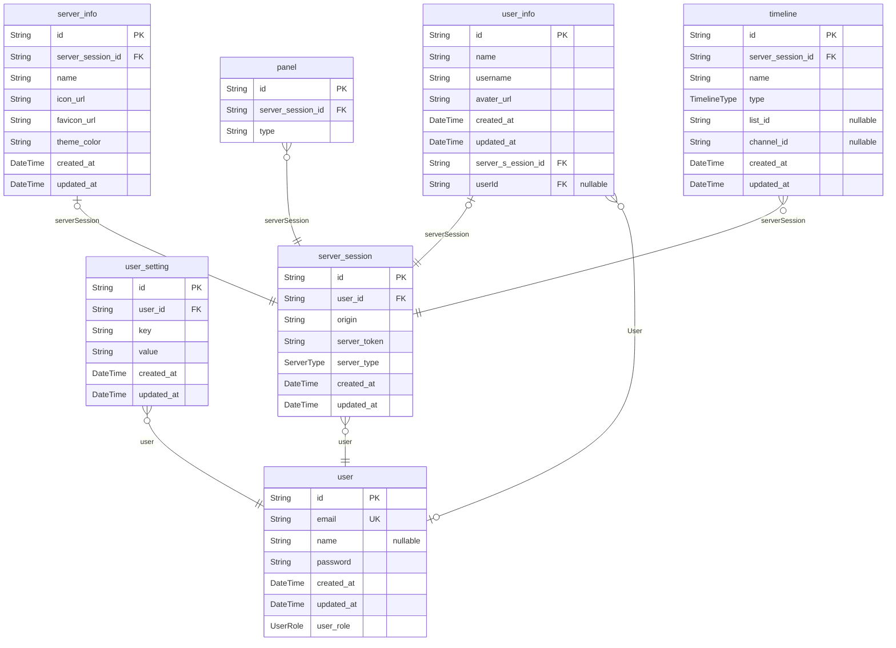

# prisma schema
> Generated by [`prisma-markdown`](https://github.com/samchon/prisma-markdown)

- [default](#default)

## default

### `user`

**Properties**
  - `id`: 
  - `email`: 
  - `name`: 
  - `password`: 
  - `created_at`: 
  - `updated_at`: 
  - `user_role`: 

### `user_setting`

**Properties**
  - `id`: 
  - `user_id`: 
  - `key`: 
  - `value`: 
  - `created_at`: 
  - `updated_at`: 

### `server_session`

**Properties**
  - `id`: 
  - `user_id`: 
  - `origin`: 
  - `server_token`: 
  - `server_type`: 
  - `created_at`: 
  - `updated_at`: 

### `server_info`

**Properties**
  - `id`: 
  - `server_session_id`: 
  - `name`: 
  - `icon_url`: 
  - `favicon_url`: 
  - `theme_color`: 
  - `created_at`: 
  - `updated_at`: 

### `user_info`

**Properties**
  - `id`: 
  - `name`: 
  - `username`: 
  - `avater_url`: 
  - `created_at`: 
  - `updated_at`: 
  - `server_s_ession_id`: 
  - `userId`: 

### `panel`

**Properties**
  - `id`: 
  - `server_session_id`: 
  - `type`: 

### `timeline`

**Properties**
  - `id`: 
  - `server_session_id`: 
  - `name`: 
  - `type`: 
  - `list_id`: 
  - `channel_id`: 
  - `created_at`: 
  - `updated_at`: 