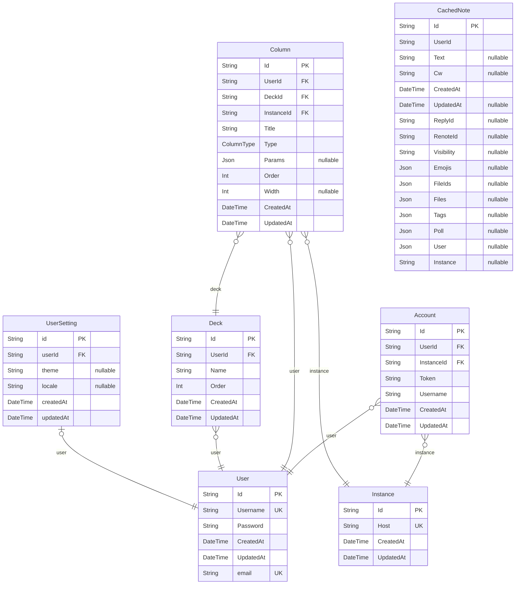

# prisma schema
> Generated by [`prisma-markdown`](https://github.com/samchon/prisma-markdown)

- [default](#default)

## default

### `User`

**Properties**
  - `Id`: 
  - `Username`: 
  - `Password`: 
  - `CreatedAt`: 
  - `UpdatedAt`: 
  - `email`: 

### `Account`

**Properties**
  - `Id`: 
  - `UserId`: 
  - `InstanceId`: 
  - `Token`: 
  - `Username`: 
  - `CreatedAt`: 
  - `UpdatedAt`: 

### `Instance`

**Properties**
  - `Id`: 
  - `Host`: 
  - `CreatedAt`: 
  - `UpdatedAt`: 

### `Column`

**Properties**
  - `Id`: 
  - `UserId`: 
  - `DeckId`: 
  - `InstanceId`: 
  - `Title`: 
  - `Type`: 
  - `Params`: 
  - `Order`: 
  - `Width`: 
  - `CreatedAt`: 
  - `UpdatedAt`: 

### `Deck`

**Properties**
  - `Id`: 
  - `UserId`: 
  - `Name`: 
  - `Order`: 
  - `CreatedAt`: 
  - `UpdatedAt`: 

### `CachedNote`

**Properties**
  - `Id`: 
  - `UserId`: 
  - `Text`: 
  - `Cw`: 
  - `CreatedAt`: 
  - `UpdatedAt`: 
  - `ReplyId`: 
  - `RenoteId`: 
  - `Visibility`: 
  - `Emojis`: 
  - `FileIds`: 
  - `Files`: 
  - `Tags`: 
  - `Poll`: 
  - `User`: 
  - `Instance`: 

### `UserSetting`

**Properties**
  - `id`: 
  - `userId`: 
  - `theme`: 
  - `locale`: 
  - `createdAt`: 
  - `updatedAt`: 