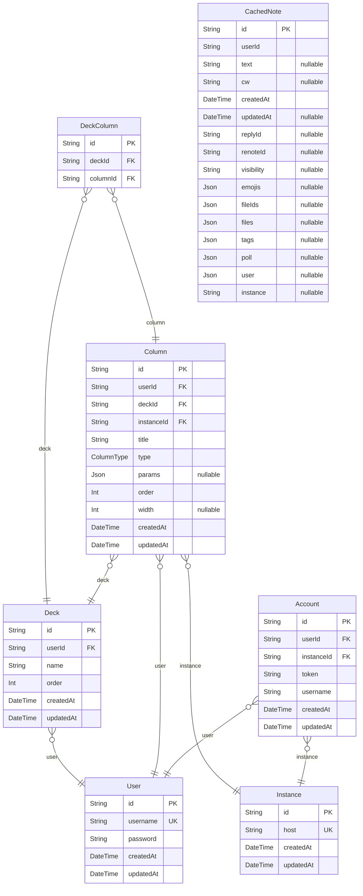

# prisma schema
> Generated by [`prisma-markdown`](https://github.com/samchon/prisma-markdown)

- [default](#default)

## default

### `User`

**Properties**
  - `id`: 
  - `username`: 
  - `password`: 
  - `createdAt`: 
  - `updatedAt`: 

### `Account`

**Properties**
  - `id`: 
  - `userId`: 
  - `instanceId`: 
  - `token`: 
  - `username`: 
  - `createdAt`: 
  - `updatedAt`: 

### `Instance`

**Properties**
  - `id`: 
  - `host`: 
  - `createdAt`: 
  - `updatedAt`: 

### `Column`

**Properties**
  - `id`: 
  - `userId`: 
  - `deckId`: 
  - `instanceId`: 
  - `title`: 
  - `type`: 
  - `params`: 
  - `order`: 
  - `width`: 
  - `createdAt`: 
  - `updatedAt`: 

### `Deck`

**Properties**
  - `id`: 
  - `userId`: 
  - `name`: 
  - `order`: 
  - `createdAt`: 
  - `updatedAt`: 

### `DeckColumn`

**Properties**
  - `id`: 
  - `deckId`: 
  - `columnId`: 

### `CachedNote`

**Properties**
  - `id`: 
  - `userId`: 
  - `text`: 
  - `cw`: 
  - `createdAt`: 
  - `updatedAt`: 
  - `replyId`: 
  - `renoteId`: 
  - `visibility`: 
  - `emojis`: 
  - `fileIds`: 
  - `files`: 
  - `tags`: 
  - `poll`: 
  - `user`: 
  - `instance`: 