# prisma schema
> Generated by [`prisma-markdown`](https://github.com/samchon/prisma-markdown)

- [default](#default)

## default

```mermaid
erDiagram
"User" {
  String id PK
  String email UK
  String name "nullable"
  String password
  DateTime createdAt
  DateTime updatedAt
  UserRole userRole
}
"UserSetting" {
  String id PK
  String userId FK
  String key
  String value
  DateTime createdAt
  DateTime updatedAt
}
"ServerSession" {
  String id PK
  String userId FK
  String origin
  String serverToken
  ServerType serverType
  DateTime createdAt
  DateTime updatedAt
}
"ServerInfo" {
  String id PK
  String serverSessionId FK,UK
  String name
  String iconUrl
  String faviconUrl
  String themeColor
  DateTime createdAt
  DateTime updatedAt
}
"UserInfo" {
  String id PK
  String name
  String username
  String avatarUrl
  DateTime createdAt
  DateTime updatedAt
  String serverSEssionId FK,UK
  String userId FK "nullable"
}
"Panel" {
  String id PK
  String serverSessionId FK
  String type
}
"Timeline" {
  String id PK
  String serverSessionId FK
  String name
  TimelineType type
  String listId "nullable"
  String channelId "nullable"
  DateTime createdAt
  DateTime updatedAt
}
"UserSetting" }o--|| "User" : user
"ServerSession" }o--|| "User" : user
"ServerInfo" |o--|| "ServerSession" : serverSession
"UserInfo" |o--|| "ServerSession" : serverSession
"UserInfo" }o--o| "User" : user
"Panel" }o--|| "ServerSession" : serverSession
"Timeline" }o--|| "ServerSession" : serverSession
```

### `User`

**Properties**
  - `id`: 
  - `email`: 
  - `name`: 
  - `password`: 
  - `createdAt`: 
  - `updatedAt`: 
  - `userRole`: 

### `UserSetting`

**Properties**
  - `id`: 
  - `userId`: 
  - `key`: 
  - `value`: 
  - `createdAt`: 
  - `updatedAt`: 

### `ServerSession`

**Properties**
  - `id`: 
  - `userId`: 
  - `origin`: 
  - `serverToken`: 
  - `serverType`: 
  - `createdAt`: 
  - `updatedAt`: 

### `ServerInfo`

**Properties**
  - `id`: 
  - `serverSessionId`: 
  - `name`: 
  - `iconUrl`: 
  - `faviconUrl`: 
  - `themeColor`: 
  - `createdAt`: 
  - `updatedAt`: 

### `UserInfo`

**Properties**
  - `id`: 
  - `name`: 
  - `username`: 
  - `avatarUrl`: 
  - `createdAt`: 
  - `updatedAt`: 
  - `serverSEssionId`: 
  - `userId`: 

### `Panel`

**Properties**
  - `id`: 
  - `serverSessionId`: 
  - `type`: 

### `Timeline`

**Properties**
  - `id`: 
  - `serverSessionId`: 
  - `name`: 
  - `type`: 
  - `listId`: 
  - `channelId`: 
  - `createdAt`: 
  - `updatedAt`: 